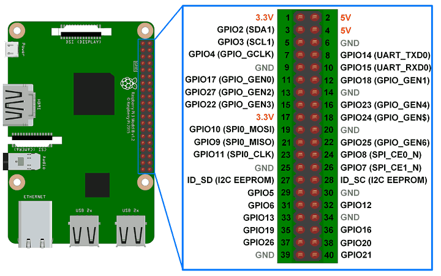

# Raspicode
High precision Python transmitter of RF 315/433Mhz codes for Raspberry Pi using GPIO via Winring Pi C library.

Implementation example as simple RESTful API Flask Web Server based to transmit "pilight" string format RF 315/433 Mhz codes named "picode".

The "pilight" project defines a special string format to easily transcribe an OOK pulse train, in order to be able to exchange it with other systems, such as a remote RF receiver/transmitter. 

Almost all wireless protocols of RC switches or weather stations use ASK/OOK pulse modulation to encode commands or other messages. See: https://github.com/latchdevel/picoder

Picode format: `c: <pulses_index> ; p: <pulse_0_lenght>, <pulse_1_lenght>, ... <pulse_n_lenght> [;r:<repeats>] @`

Picode example: `c:011010100101011010100110101001100110010101100110101010101010101012;p:1400,600,6800@`

Transmit example: 
```bash
$ curl "http://localhost:8087/picode/c:011010100101011010100110101001100110010101100110101010101010101012;p:1400,600,6800@"
RF TX sent picode in 286 ms OK
``` 

## The timing problem
The RF protocols use AM ASK modulation to encode OOK pulse trains. The length of ON/OFF pulses is of microseconds range, from 100 uSecs for the shortest ones, up to 100,000 uSecs for the longest ones, which are usually used as final OFF pulse to separation between repeats (footer pulse).

Managing such small time periods accurately is easy for microcontrollers like Atmel/Pic or others commonly used with Arduino framework.
But it is a big challenge for a Linux system, and much more to do it in a high-level interpreted language like Python.

There are several approaches:
- **Very poor**: Using "time" module like as `time.sleep(usecs/1000000.0)` argument may be a floating point number to indicate a more precise sleep time.
- **Poor**: From Python 3.7 "time" module have `time.time_ns()` function that returns time as an integer number of nanoseconds since the epoch. 
- **Poor**: Using "ctypes" to call dynamic C library `usleep()` function. See: https://github.com/ElectricRCAircraftGuy/eRCaGuy_PyTime
- **Excellent**: Python C Extension Module to implement a high precision time handling in low-level C language.

## Wiring Pi: the solution for everything
WiringPi is a GPIO access library written in C for SoC devices used in all Raspberry Pi.
It's designed to be familiar to people who have used the Arduino "wiring" system and is intended for use by experienced C/C++ programmers.

The WiringPi is very extensive, includes support for many devices, several protocols and operation modes, but since the functionality required is very limited and specific, only the two main files `wiringPi.h` and `wiringPi.c` have been required with minor modifications for ease of use:

- Remove softPwm and softTone support
- Remove all PWM init modes
- Remove threads functions
- Remove schedulling priority piHiPri 
- Expose delayMicrosecondsHard function

Wiring Pi is the ideal solution to handle digital GPIOs and solve the timing problem through its **delayMicrosecondsHard()** function.
There are other ways to handle GPIOs, but they are not as simple or as widespread. See: https://elinux.org/RPi_GPIO_Code_Samples

### delayMicrosecondsHard(unsigned int howLong)
Hard loop for watching a built-in counter on the ARM SoC. This uses 100% of assignated CPU something not an issue for recent multi-core SoCs.
```c
void delayMicrosecondsHard (unsigned int howLong)
{
  struct timeval tNow, tLong, tEnd ;

  gettimeofday (&tNow, NULL) ;
  tLong.tv_sec  = howLong / 1000000 ;
  tLong.tv_usec = howLong % 1000000 ;
  timeradd (&tNow, &tLong, &tEnd) ;

  while (timercmp (&tNow, &tEnd, <))
    gettimeofday (&tNow, NULL) ;
}
```

## WiringPiOOK
Python C Extension Module to send OOK pulse train to digital GPIO using wiringPi library.

Use only these four native C functions:

- **wiringPiSetupGpio()** to initialize wiringPi GPIO manage via native Broadcom GPIO numbers.
- **pinMode(gpio,mode)** to configure the specified GPIO number to behave either as OUTPUT. 
- **digitalWrite(gpio,state)** to set GPIO state, HIGH for odd pulse index or LOW for even pulse index.
- **delayMicrosecondsHard(usecs)** to high precision microseconds program execution pause.

To build the module:  `$ python3 setup.py develop --user`

The "**wiringpiook**" module only has the function "**tx()**", to transmit pulse train using gpio digital levels.
Return total transmission time in milliseconds or a negative error code.

Usage: `tx(bcm_gpio,pulse_list,repeats=4)`

Example:
```python
>>> import wiringpiook
>>> wiringpiook.tx(21,[500,500,2000,2000])
>>> 20
```

## Process affinity to isolated CPU
For better timing accuracy when code transmit, the Python script should be executed in a CPU isolated from the OS scheduler.

CPU isolation is a powerful set of features that can be found behind the settings for workloads which rely on specific and often extreme latency or performance requirements. 

"isolcpus" is one of the Linux kernel boot params that isolated certain cpus from kernel scheduling, which is especially useful if you want to dedicate some cpus for special tasks with least unwanted interruption (but cannot get to zero) in a multi-core system.

Remove the specified CPUs, as defined by the cpu_number values, from the general kernel SMP balancing and scheduler algroithms.

Raspberry Pi models 2, 3, 4 and Zero 2, have 4 cores, cpus: `{0,1,2,3}`, so is possible to dedicate one CPU to improve the transmission without much impact over system.

Add `isolcpus=3` to file `/boot/cmdline.txt` and reboot system.

Example of `/boot/cmdline.txt` file::
```
console=serial0,115200 console=tty1 root=PARTUUID=47cac5b4-02 rootfstype=ext4 fsck.repair=yes rootwait isolcpus=3
```

To verify:
```bash
$ cat /sys/devices/system/cpu/isolated
3
```

To manual set cpu affinity when run a program use:
```
$ taskset -c 3 ./raspicode.py
```

Anyway, if there are CPUs isolated from the OS, Python script will try to set affinity to one of the isolated CPUs:
```
[2022-09-19 00:24:38,782] 1388 WARINING - Process id: 1388 not OS scheduler isolated cpu process affinity
[2022-09-19 00:24:38,784] 1388 WARINING - Trying to set process affinity cpu: {3}
[2022-09-19 00:24:38,786] 1388 INFO - OK Process id: 1388 affinity cpu: {3} isolated from OS scheduler cpu: {0, 1, 2}
[2022-09-19 00:24:38,787] 1388 INFO - Web server binding to 0.0.0.0 port 8087 local url http://192.168.1.49:8087/
```

## GPIO
WiringPi defines 17 GPIOs (21 from Rev 2 board), but some of them and the functions we can use may potentially cause problems with other parts of the Raspberry Pi Linux system.

GPIOs that have specific uses on the Raspberry Pi should be avoided:
- GPIO02 and GPIO03 are used by internal I2C bus and are always in a high state (pull-up).
- GPIO14 and GPIO15 are used by internal UART for bluetooth or serial console.
- GPIO07, GPIO08, GPIO09, GPIO10, and GPIO11 are used by internal SPI bus.
- GPIO04 is used by internal 1-Wire bus.



The Raspberry Pi is a 3.3 volt device! Attempting to directly connect to any 5V logic system  will very likely result in tears…

See: http://wiringpi.com/pins/special-pin-functions/

## Accuracy test

Accuracy test from 5 microSeconds to 100000 microSeconds (0.1 Sec), 195 pulses (logarithmic distribution).

Test environment:
- Raspberry Pi 3B+ running Debian (bullseye) kernel 5.15.61-v8+ 64-bit.
- Process affinity to OS scheduler isolated cpu: {3}.
- Output GPIO: 21.
- Measured by Saleae Logic16 (clone) logic analyzer using Logic 2 (v2.4.0) software. See: https://www.saleae.com/
- Sample rate: 100MS/s (nanoSeconds resolution).


### Results:
- Only two pulses (1%) above the acceptable error range.
- Median rate error below 0.004% (0.6% average).

 

### Conclusions:
- Excellent general performance.
- Ready to RF transmit codes.

## STX882: The best cheap RF transmitter module
Low Cost & High power: 315/433MHz ASK Transmitter Module STX882 from NiceRF: https://www.nicerf.com/products/detail/433mhz-ask-transmitter-module-stx882.html

The STX882 datasheet says "RF Power" up to 20dBm at 5v, but in my measurements I only got a little over 17dBm (50mW), which is very good, as well as having low harmonic distortion.

It is certainly the best cheap RF transmitter module, you can see an interesting comparison in this blog: http://x311.blogspot.com/2017/10/comparison-of-cheap-rf-modules-with-ask.html

  

Wire connections:
  - RF TX module VCC pin to Raspberry Pi pin 2 (5vcc).
  - RF TX module GND pin to Raspberry Pi pin 6 (GND).
  - RF TX module DATA pin to Raspberry Pi pin 12 (GPIO18).
  - RF TX module ANTENNA pin to an antenna tuned to specific frequency used.

Remember that in any radio frequency system, the most important element is the antenna.

## API endpoints:
- `/picode/:picode` method "GET" to transmit the "picode". 

  Multiline picodes are allowed. The characters `+`, `\n` and others are valid for splitting. In multiline picodes the default repeat is 1 instead of 4.

  Returns plain text picode transmission result, showing the total TX time in milliseconds or an error description on failure.

  Example:
    ```bash
      $ curl "http://localhost:8087/picode/c:011010100101011010100110101001100110010101100110101010101010101012;p:1400,600,6800;r:4@+c:011010100101011010100110101001100110010101100110101010101010101012;p:1400,600,6800;r:4@"
      RF TX sent picode in 571 ms OK
    ```

- `/picode` method "GET" or "POST" with "picode" form parameter to transmit a picode.

  Multiline picodes are allowed. The characters `+`, `\n` and others are valid for splitting. In multiline picodes the default repeat is 1 instead of 4.

  Returns plain text picode transmission result, showing the total TX time in milliseconds or an error description on failure.
  
  Examples:
    ```bash
      $ curl -X POST -d "picode=c:011010100101011010100110101001100110010101100110101010101010101012;p:1400,600,6800@" http://localhost:8087/picode
      RF TX sent picode in 286 ms OK

      $ curl -X GET "http://localhost:8087/picode?picode=c:011010100101011010100110101001100110010101100110101010101010101012;p:1400,600,6800@"
      RF TX sent picode in 286 ms OK
    ```

- `/status` method "GET returns json status:
    ```json
      {
        "isolated_cpu_affinity": "{3}", 
        "last_tx": "2022-09-22 20:22:21", 
        "logs_directory": "/home/pi/raspicode/logs/", 
        "proccess_pid": 1052, 
        "script_path": "/home/pi/raspicode/raspicode.py", 
        "start_time": "2022-09-22 20:19:39", 
        "tx_count": 2, 
        "uptime": "8 minutes, 21 seconds"
      }
    ```
- `/config` method "GET" return json config:
    ```json
      {
        "digest": "4460c931f5eeae6d631196d8ab4a3c0d", 
        "listen_ip": "0.0.0.0", 
        "listen_port": "8087", 
        "log_name": "web_internal.log", 
        "logs_dir": "logs", 
        "tx_gpio": 18
      }
    ```

### Logs access:
- `/logs` method "GET" to request the HTML directory logs file explorer.

- `/logs/:filename` method "GET" to request a text plain file log.

### Landing page:
- `/` method "GET" to request the HTML "landing page":


# License
Copyright (c) 2022 Jorge Rivera. All right reserved.

License GNU Lesser General Public License v3.0.

This library is free software; you can redistribute it and/or
modify it under the terms of the GNU Lesser General Public
License as published by the Free Software Foundation; either
version 3 of the License, or (at your option) any later version.

This library is distributed in the hope that it will be useful,
but WITHOUT ANY WARRANTY; without even the implied warranty of
MERCHANTABILITY or FITNESS FOR A PARTICULAR PURPOSE.  See the GNU
Lesser General Public License for more details.

You should have received a copy of the GNU Lesser General Public License 
along with this library; if not, write to the Free Software Foundation, 
Inc., 51 Franklin St, Fifth Floor, Boston, MA  02110-1301, USA.

See the [LICENSE](LICENSE.md) file for license rights and limitations (lgpl-3.0).